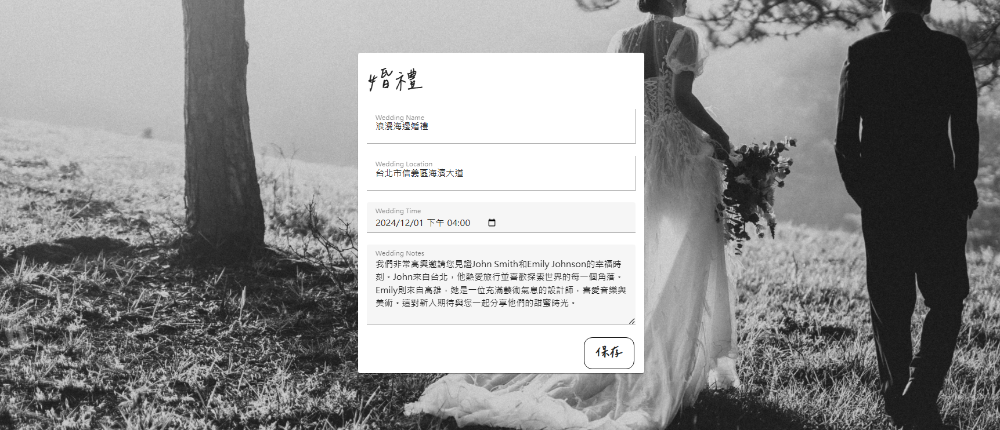

## AURORA BLISS Wedding Planning Website
## 💡Overview
This project is a Wedding Planning Website management, based on **Vue.js 3** and **ASP.NET Core WebAPI**. The database management is implemented using **Microsoft SQL Server 2022**.

## ✨ Key features
### Homepage & To-Do List & Contact Us
[](https://drive.google.com/file/d/1UdTG0Hcuvvtp8PgMuwFSphnjUCDDBF0u/view?usp=drive_link)
### Wedding Scene Decoration Simulator
[]([https://www.youtube.com/watch?v=example](https://drive.google.com/file/d/1q_biCjmvPCxhFfJv9o2nE4JEOxoxZ4yc/view?usp=drive_link))
### Event Schedule Planning
[]([https://www.youtube.com/watch?v=example](https://drive.google.com/file/d/1ZS-Qi6YeyHihkE7jRfe6uDorJE5bL2hL/view?usp=drive_link))

### Leave a review for the shop
Members can leave their reviews for specific shop.

### Wedding budget management 

### Obtain a wedding plan 


## ▶ Run Locally
It is also necessary to start both the backend and the WebAPI simultaneously.
####  Clone the projects to your local environment.

   >     $ git clone https://github.com/evelynYen97/WeddingPlanningReport.git
   >     $ git clone https://github.com/evelynYen97/WeddingPlanningWebAPI.git


👇This template should help get you started developing with Vue 3 in Vite.

## Recommended IDE Setup

[VSCode](https://code.visualstudio.com/) + [Volar](https://marketplace.visualstudio.com/items?itemName=Vue.volar) (and disable Vetur).

## Customize configuration

See [Vite Configuration Reference](https://vitejs.dev/config/).

## Project Setup

```sh
npm install
```

### Run Unit Tests with [Vitest](https://vitest.dev/)

```sh
npm run test:unit
```
